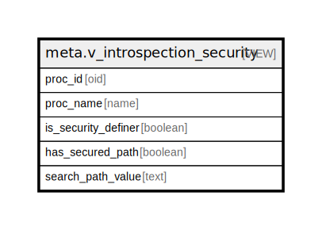

# meta.v_introspection_security

## Description

<details>
<summary><strong>Table Definition</strong></summary>

```sql
CREATE VIEW v_introspection_security AS (
 WITH sp_extract AS (
         SELECT pg_proc.oid,
            pg_proc.proname,
            pg_proc.prosecdef,
            ( SELECT split_part(cfg.cfg, '='::text, 2) AS split_part
                   FROM unnest(pg_proc.proconfig) cfg(cfg)
                  WHERE (cfg.cfg ~~ 'search_path=%'::text)
                 LIMIT 1) AS sp_value
           FROM pg_proc
          WHERE (pg_proc.prokind = 'p'::"char")
        )
 SELECT oid AS proc_id,
    proname AS proc_name,
    prosecdef AS is_security_definer,
    ((sp_value IS NOT NULL) AND (sp_value <> ''::text) AND (sp_value !~~ '%public%'::text) AND (sp_value !~~ '%$user%'::text)) AS has_secured_path,
    sp_value AS search_path_value
   FROM sp_extract
)
```

</details>

## Columns

| Name | Type | Default | Nullable | Children | Parents | Comment |
| ---- | ---- | ------- | -------- | -------- | ------- | ------- |
| proc_id | oid |  | true |  |  |  |
| proc_name | name |  | true |  |  |  |
| is_security_definer | boolean |  | true |  |  |  |
| has_secured_path | boolean |  | true |  |  |  |
| search_path_value | text |  | true |  |  |  |

## Referenced Tables

| Name | Columns | Comment | Type |
| ---- | ------- | ------- | ---- |
| [unnest](unnest.md) | 0 |  |  |
| [pg_proc](pg_proc.md) | 0 |  |  |

## Relations



---

> Generated by [tbls](https://github.com/k1LoW/tbls)
