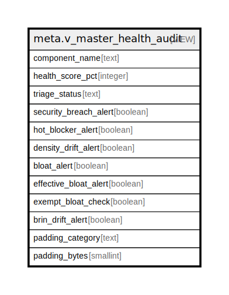

# meta.v_master_health_audit

## Description

<details>
<summary><strong>Table Definition</strong></summary>

```sql
CREATE VIEW v_master_health_audit AS (
 WITH component_status AS (
         SELECT m.component_name,
            m.density_drift_alert,
            m.security_breach_alert,
            COALESCE(s.hot_blocker_alert, false) AS hot_blocker_alert,
            COALESCE(s.brin_drift_alert, false) AS brin_drift_alert,
            COALESCE(s.bloat_alert, false) AS bloat_alert,
            ci.exempt_bloat_check,
            m.padding_bytes
           FROM ((meta.v_extended_containment_security_matrix m
             LEFT JOIN meta.v_performance_sentinel s ON ((s.component_id = m.component_name)))
             JOIN meta.containment_intent ci ON ((ci.component_id = m.component_name)))
        ), scoring AS (
         SELECT component_status.component_name,
            component_status.density_drift_alert,
            component_status.security_breach_alert,
            component_status.hot_blocker_alert,
            component_status.brin_drift_alert,
            component_status.bloat_alert,
            component_status.exempt_bloat_check,
            component_status.padding_bytes,
            (component_status.bloat_alert AND (NOT component_status.exempt_bloat_check)) AS effective_bloat_alert,
            ((((
                CASE
                    WHEN component_status.security_breach_alert THEN 100
                    ELSE 0
                END +
                CASE
                    WHEN component_status.hot_blocker_alert THEN 60
                    ELSE 0
                END) +
                CASE
                    WHEN component_status.density_drift_alert THEN 30
                    ELSE 0
                END) +
                CASE
                    WHEN (component_status.bloat_alert AND (NOT component_status.exempt_bloat_check)) THEN 30
                    ELSE 0
                END) +
                CASE
                    WHEN component_status.brin_drift_alert THEN 20
                    ELSE 0
                END) AS debt_score
           FROM component_status
        )
 SELECT component_name,
    GREATEST((100 - debt_score), 0) AS health_score_pct,
        CASE
            WHEN (debt_score = 0) THEN 'OPTIMAL'::text
            WHEN (debt_score >= 100) THEN 'CRITICAL (SECURITY BREACH)'::text
            WHEN hot_blocker_alert THEN 'SEVERE (HOT PATH BLOCKED)'::text
            ELSE 'WARNING (LAYOUT/DRIFT DEGRADATION)'::text
        END AS triage_status,
    security_breach_alert,
    hot_blocker_alert,
    density_drift_alert,
    bloat_alert,
    effective_bloat_alert,
    exempt_bloat_check,
    brin_drift_alert,
        CASE
            WHEN (padding_bytes IS NULL) THEN NULL::text
            WHEN (padding_bytes < 4) THEN 'OPTIMAL'::text
            WHEN (padding_bytes < 8) THEN 'WARNING'::text
            ELSE 'INVESTIGATE'::text
        END AS padding_category,
    padding_bytes
   FROM scoring
  ORDER BY GREATEST((100 - debt_score), 0), component_name
)
```

</details>

## Columns

| Name | Type | Default | Nullable | Children | Parents | Comment |
| ---- | ---- | ------- | -------- | -------- | ------- | ------- |
| component_name | text |  | true |  |  |  |
| health_score_pct | integer |  | true |  |  |  |
| triage_status | text |  | true |  |  |  |
| security_breach_alert | boolean |  | true |  |  |  |
| hot_blocker_alert | boolean |  | true |  |  |  |
| density_drift_alert | boolean |  | true |  |  |  |
| bloat_alert | boolean |  | true |  |  |  |
| effective_bloat_alert | boolean |  | true |  |  |  |
| exempt_bloat_check | boolean |  | true |  |  |  |
| brin_drift_alert | boolean |  | true |  |  |  |
| padding_category | text |  | true |  |  |  |
| padding_bytes | smallint |  | true |  |  |  |

## Referenced Tables

| Name | Columns | Comment | Type |
| ---- | ------- | ------- | ---- |
| [meta.v_extended_containment_security_matrix](meta.v_extended_containment_security_matrix.md) | 16 |  | VIEW |
| [meta.v_performance_sentinel](meta.v_performance_sentinel.md) | 13 | Audit de performance AOT/DOD : HOT-BLOCKER (colonnes mutables indexees via immutable_keys + pg_index), BRIN-DRIFT (correlation physique < 0.90, pire cas multi-BRIN), BLOAT (pg_relation_size / n_live_tup vs intent_density / fillfactor * 1.20). Court-circuit exempt_bloat_check : bloat_alert=FALSE pour les tables dictionnaire (faible cardinalite, immuables en production — identity.role). Correction fillfactor obligatoire : tables ff<100 (auth ff=70, product_core ff=80) produisent des faux positifs sans elle. Prerequis : ANALYZE execute. ADR-006 / ADR-010 / ADR-030 . meta_registry v2. | VIEW |
| [meta.containment_intent](meta.containment_intent.md) | 7 |  | BASE TABLE |
| [scoring](scoring.md) | 0 |  |  |

## Relations



---

> Generated by [tbls](https://github.com/k1LoW/tbls)
