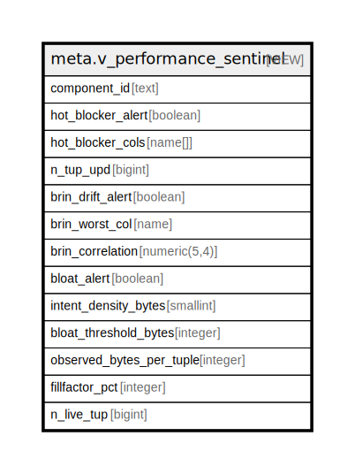

# meta.v_performance_sentinel

## Description

Audit de performance AOT/DOD : HOT-BLOCKER (colonnes mutables indexees via immutable_keys + pg_index), BRIN-DRIFT (correlation physique < 0.90, pire cas multi-BRIN), BLOAT (pg_relation_size / n_live_tup vs intent_density / fillfactor * 1.20). Court-circuit exempt_bloat_check : bloat_alert=FALSE pour les tables dictionnaire (faible cardinalite, immuables en production — identity.role). Correction fillfactor obligatoire : tables ff<100 (auth ff=70, product_core ff=80) produisent des faux positifs sans elle. Prerequis : ANALYZE execute. ADR-006 / ADR-010 / ADR-030 . meta_registry v2.

<details>
<summary><strong>Table Definition</strong></summary>

```sql
CREATE VIEW v_performance_sentinel AS (
 WITH components AS (
         SELECT ci.component_id,
            ci.intent_density_bytes,
            ci.immutable_keys,
            ci.exempt_bloat_check,
            pc.oid AS reloid,
            n.nspname AS schemaname,
            pc.relname AS tablename,
            ((COALESCE(( SELECT (regexp_replace(t.opt, '^fillfactor='::text, ''::text))::integer AS regexp_replace
                   FROM unnest(pc.reloptions) t(opt)
                  WHERE (t.opt ~~ 'fillfactor=%'::text)
                 LIMIT 1), 100))::numeric / 100.0) AS fillfactor_ratio
           FROM ((meta.containment_intent ci
             JOIN pg_class pc ON ((pc.oid = (to_regclass(ci.component_id))::oid)))
             JOIN pg_namespace n ON ((n.oid = pc.relnamespace)))
          WHERE (to_regclass(ci.component_id) IS NOT NULL)
        ), tbl_stats AS (
         SELECT psu.relid,
            psu.n_tup_upd,
            psu.n_live_tup
           FROM pg_stat_user_tables psu
        ), hot_blockers AS (
         SELECT c_1.component_id,
            array_agg(DISTINCT a.attname ORDER BY a.attname) AS blocking_cols
           FROM ((components c_1
             JOIN pg_index i ON (((i.indrelid = c_1.reloid) AND (NOT i.indisprimary) AND (NOT i.indisexclusion))))
             JOIN pg_attribute a ON (((a.attrelid = i.indrelid) AND (a.attnum = ANY ((i.indkey)::smallint[])) AND (a.attnum > 0) AND (NOT a.attisdropped))))
          WHERE ((c_1.immutable_keys IS NULL) OR (a.attname <> ALL (c_1.immutable_keys)))
          GROUP BY c_1.component_id
        ), brin_health AS (
         SELECT DISTINCT ON (c_1.component_id) c_1.component_id,
            a.attname AS brin_worst_col,
            (abs(ps.correlation))::numeric(5,4) AS min_abs_correlation
           FROM (((((components c_1
             JOIN pg_index i ON ((i.indrelid = c_1.reloid)))
             JOIN pg_class ic ON ((ic.oid = i.indexrelid)))
             JOIN pg_am am ON (((am.oid = ic.relam) AND (am.amname = 'brin'::name))))
             JOIN pg_attribute a ON (((a.attrelid = i.indrelid) AND (a.attnum = ((i.indkey)::smallint[])[1]) AND (a.attnum > 0) AND (NOT a.attisdropped))))
             LEFT JOIN pg_stats ps ON (((ps.schemaname = c_1.schemaname) AND (ps.tablename = c_1.tablename) AND (ps.attname = a.attname))))
          WHERE (ps.correlation IS NOT NULL)
          ORDER BY c_1.component_id, (abs(ps.correlation))
        )
 SELECT c.component_id,
    ((COALESCE(s.n_tup_upd, (0)::bigint) > 0) AND (hb.component_id IS NOT NULL)) AS hot_blocker_alert,
    hb.blocking_cols AS hot_blocker_cols,
    COALESCE(s.n_tup_upd, (0)::bigint) AS n_tup_upd,
    (bh.min_abs_correlation < 0.90) AS brin_drift_alert,
    bh.brin_worst_col,
    bh.min_abs_correlation AS brin_correlation,
        CASE
            WHEN c.exempt_bloat_check THEN false
            WHEN (NULLIF(s.n_live_tup, 0) IS NULL) THEN NULL::boolean
            WHEN (((pg_relation_size((c.reloid)::regclass))::numeric / (s.n_live_tup)::numeric) > (((c.intent_density_bytes)::numeric / c.fillfactor_ratio) * 1.20)) THEN true
            ELSE false
        END AS bloat_alert,
    c.intent_density_bytes,
    ((((c.intent_density_bytes)::numeric / c.fillfactor_ratio) * 1.20))::integer AS bloat_threshold_bytes,
        CASE
            WHEN (NULLIF(s.n_live_tup, 0) IS NOT NULL) THEN (((pg_relation_size((c.reloid)::regclass))::numeric / (s.n_live_tup)::numeric))::integer
            ELSE NULL::integer
        END AS observed_bytes_per_tuple,
    ((c.fillfactor_ratio * (100)::numeric))::integer AS fillfactor_pct,
    s.n_live_tup
   FROM (((components c
     LEFT JOIN tbl_stats s ON ((s.relid = c.reloid)))
     LEFT JOIN hot_blockers hb ON ((hb.component_id = c.component_id)))
     LEFT JOIN brin_health bh ON ((bh.component_id = c.component_id)))
)
```

</details>

## Columns

| Name | Type | Default | Nullable | Children | Parents | Comment |
| ---- | ---- | ------- | -------- | -------- | ------- | ------- |
| component_id | text |  | true |  |  |  |
| hot_blocker_alert | boolean |  | true |  |  |  |
| hot_blocker_cols | name[] |  | true |  |  |  |
| n_tup_upd | bigint |  | true |  |  |  |
| brin_drift_alert | boolean |  | true |  |  |  |
| brin_worst_col | name |  | true |  |  |  |
| brin_correlation | numeric(5,4) |  | true |  |  |  |
| bloat_alert | boolean |  | true |  |  |  |
| intent_density_bytes | smallint |  | true |  |  |  |
| bloat_threshold_bytes | integer |  | true |  |  |  |
| observed_bytes_per_tuple | integer |  | true |  |  |  |
| fillfactor_pct | integer |  | true |  |  |  |
| n_live_tup | bigint |  | true |  |  |  |

## Referenced Tables

| Name | Columns | Comment | Type |
| ---- | ------- | ------- | ---- |
| [unnest](unnest.md) | 0 |  |  |
| [meta.containment_intent](meta.containment_intent.md) | 7 |  | BASE TABLE |
| [pg_class](pg_class.md) | 0 |  |  |
| [pg_namespace](pg_namespace.md) | 0 |  |  |
| [pg_stat_user_tables](pg_stat_user_tables.md) | 0 |  |  |
| [pg_index](pg_index.md) | 0 |  |  |
| [pg_attribute](pg_attribute.md) | 0 |  |  |
| [pg_am](pg_am.md) | 0 |  |  |
| [pg_stats](pg_stats.md) | 0 |  |  |
| [tbl_stats](tbl_stats.md) | 0 |  |  |
| [hot_blockers](hot_blockers.md) | 0 |  |  |
| [brin_health](brin_health.md) | 0 |  |  |

## Relations



---

> Generated by [tbls](https://github.com/k1LoW/tbls)
