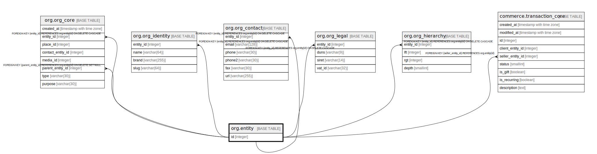

# org.entity

## Description

## Columns

| Name | Type | Default | Nullable | Children | Parents | Comment |
| ---- | ---- | ------- | -------- | -------- | ------- | ------- |
| id | integer |  | false | [org.org_core](org.org_core.md) [org.org_identity](org.org_identity.md) [org.org_contact](org.org_contact.md) [org.org_legal](org.org_legal.md) [org.org_hierarchy](org.org_hierarchy.md) [commerce.transaction_core](commerce.transaction_core.md) |  |  |

## Constraints

| Name | Type | Definition |
| ---- | ---- | ---------- |
| entity_pkey | PRIMARY KEY | PRIMARY KEY (id) |

## Indexes

| Name | Definition |
| ---- | ---------- |
| entity_pkey | CREATE UNIQUE INDEX entity_pkey ON org.entity USING btree (id) |

## Relations

---

> Generated by [tbls](https://github.com/k1LoW/tbls)
