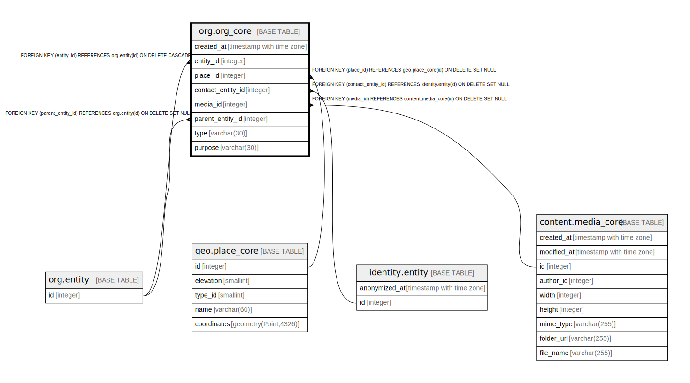

# org.org_core

## Description

## Columns

| Name | Type | Default | Nullable | Children | Parents | Comment |
| ---- | ---- | ------- | -------- | -------- | ------- | ------- |
| created_at | timestamp with time zone | now() | false |  |  |  |
| entity_id | integer |  | false |  | [org.entity](org.entity.md) |  |
| place_id | integer |  | true |  | [geo.place_core](geo.place_core.md) |  |
| contact_entity_id | integer |  | true |  | [identity.entity](identity.entity.md) |  |
| media_id | integer |  | true |  | [content.media_core](content.media_core.md) |  |
| parent_entity_id | integer |  | true |  | [org.entity](org.entity.md) |  |
| type | varchar(30) |  | true |  |  |  |
| purpose | varchar(30) |  | true |  |  |  |

## Constraints

| Name | Type | Definition |
| ---- | ---- | ---------- |
| fk_org_core_contact_entity | FOREIGN KEY | FOREIGN KEY (contact_entity_id) REFERENCES identity.entity(id) ON DELETE SET NULL |
| fk_org_core_place | FOREIGN KEY | FOREIGN KEY (place_id) REFERENCES geo.place_core(id) ON DELETE SET NULL |
| org_core_entity_id_fkey | FOREIGN KEY | FOREIGN KEY (entity_id) REFERENCES org.entity(id) ON DELETE CASCADE |
| org_core_parent_entity_id_fkey | FOREIGN KEY | FOREIGN KEY (parent_entity_id) REFERENCES org.entity(id) ON DELETE SET NULL |
| org_core_pkey | PRIMARY KEY | PRIMARY KEY (entity_id) |
| fk_org_core_media | FOREIGN KEY | FOREIGN KEY (media_id) REFERENCES content.media_core(id) ON DELETE SET NULL |

## Indexes

| Name | Definition |
| ---- | ---------- |
| org_core_pkey | CREATE UNIQUE INDEX org_core_pkey ON org.org_core USING btree (entity_id) |
| org_core_parent | CREATE INDEX org_core_parent ON org.org_core USING btree (parent_entity_id) WHERE (parent_entity_id IS NOT NULL) |
| org_core_created_brin | CREATE INDEX org_core_created_brin ON org.org_core USING brin (created_at) WITH (pages_per_range='64') |

## Triggers

| Name | Definition |
| ---- | ---------- |
| org_core_deny_created_at_update | CREATE TRIGGER org_core_deny_created_at_update BEFORE UPDATE ON org.org_core FOR EACH ROW WHEN ((old.created_at IS DISTINCT FROM new.created_at)) EXECUTE FUNCTION identity.fn_deny_created_at_update() |

## Relations

---

> Generated by [tbls](https://github.com/k1LoW/tbls)
