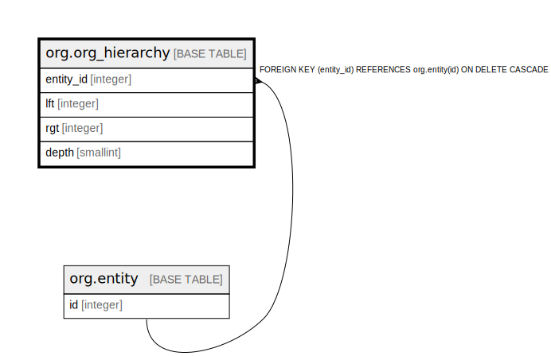

# org.org_hierarchy

## Description

## Columns

| Name | Type | Default | Nullable | Children | Parents | Comment |
| ---- | ---- | ------- | -------- | -------- | ------- | ------- |
| entity_id | integer |  | false |  | [org.entity](org.entity.md) |  |
| lft | integer | 1 | false |  |  |  |
| rgt | integer | 2 | false |  |  |  |
| depth | smallint | 0 | false |  |  |  |

## Constraints

| Name | Type | Definition |
| ---- | ---- | ---------- |
| depth_positive | CHECK | CHECK ((depth >= 0)) |
| lft_rgt_order | CHECK | CHECK ((lft < rgt)) |
| org_hierarchy_entity_id_fkey | FOREIGN KEY | FOREIGN KEY (entity_id) REFERENCES org.entity(id) ON DELETE CASCADE |
| org_hierarchy_pkey | PRIMARY KEY | PRIMARY KEY (entity_id) |

## Indexes

| Name | Definition |
| ---- | ---------- |
| org_hierarchy_pkey | CREATE UNIQUE INDEX org_hierarchy_pkey ON org.org_hierarchy USING btree (entity_id) |
| org_hierarchy_interval | CREATE INDEX org_hierarchy_interval ON org.org_hierarchy USING btree (lft, rgt) |

## Relations

---

> Generated by [tbls](https://github.com/k1LoW/tbls)
