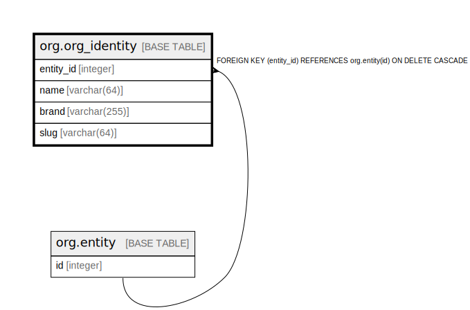

# org.org_identity

## Description

## Columns

| Name | Type | Default | Nullable | Children | Parents | Comment |
| ---- | ---- | ------- | -------- | -------- | ------- | ------- |
| entity_id | integer |  | false |  | [org.entity](org.entity.md) |  |
| name | varchar(64) |  | false |  |  |  |
| brand | varchar(255) |  | true |  |  |  |
| slug | varchar(64) |  | false |  |  |  |

## Constraints

| Name | Type | Definition |
| ---- | ---- | ---------- |
| slug_format | CHECK | CHECK (((slug)::text ~ '^[a-z0-9-]+$'::text)) |
| org_identity_entity_id_fkey | FOREIGN KEY | FOREIGN KEY (entity_id) REFERENCES org.entity(id) ON DELETE CASCADE |
| org_identity_pkey | PRIMARY KEY | PRIMARY KEY (entity_id) |
| org_identity_slug_key | UNIQUE | UNIQUE (slug) |

## Indexes

| Name | Definition |
| ---- | ---------- |
| org_identity_pkey | CREATE UNIQUE INDEX org_identity_pkey ON org.org_identity USING btree (entity_id) |
| org_identity_slug_key | CREATE UNIQUE INDEX org_identity_slug_key ON org.org_identity USING btree (slug) |
| org_identity_name_trgm | CREATE INDEX org_identity_name_trgm ON org.org_identity USING gin (immutable_unaccent((name)::text) gin_trgm_ops) |

## Relations

---

> Generated by [tbls](https://github.com/k1LoW/tbls)
