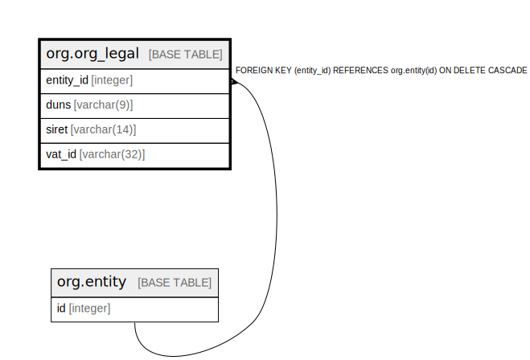

# org.org_legal

## Description

## Columns

| Name | Type | Default | Nullable | Children | Parents | Comment |
| ---- | ---- | ------- | -------- | -------- | ------- | ------- |
| entity_id | integer |  | false |  | [org.entity](org.entity.md) |  |
| duns | varchar(9) |  | true |  |  |  |
| siret | varchar(14) |  | true |  |  |  |
| vat_id | varchar(32) |  | true |  |  |  |

## Constraints

| Name | Type | Definition |
| ---- | ---- | ---------- |
| duns_format | CHECK | CHECK (((duns IS NULL) OR ((duns)::text ~ '^[0-9]{9}$'::text))) |
| siret_format | CHECK | CHECK (((siret IS NULL) OR ((siret)::text ~ '^[0-9]{14}$'::text))) |
| org_legal_entity_id_fkey | FOREIGN KEY | FOREIGN KEY (entity_id) REFERENCES org.entity(id) ON DELETE CASCADE |
| org_legal_pkey | PRIMARY KEY | PRIMARY KEY (entity_id) |

## Indexes

| Name | Definition |
| ---- | ---------- |
| org_legal_pkey | CREATE UNIQUE INDEX org_legal_pkey ON org.org_legal USING btree (entity_id) |

## Relations

---

> Generated by [tbls](https://github.com/k1LoW/tbls)
