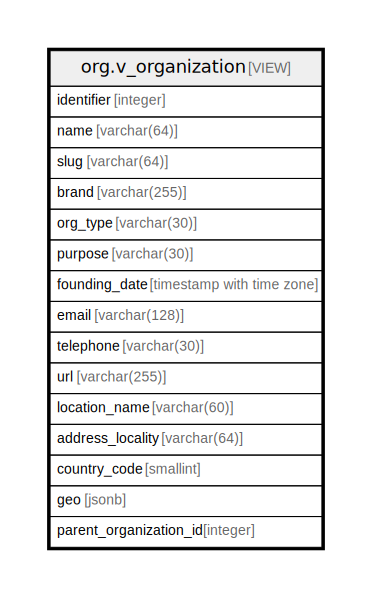

# org.v_organization

## Description

<details>
<summary><strong>Table Definition</strong></summary>

```sql
CREATE VIEW v_organization AS (
 SELECT e.id AS identifier,
    oi.name,
    oi.slug,
    oi.brand,
    oc.type AS org_type,
    oc.purpose,
    oc.created_at AS founding_date,
    oct.email,
    oct.phone AS telephone,
    oct.url,
    gp.name AS location_name,
    gp.address_locality,
    gp.country_code,
    gp.geo,
    oc.parent_entity_id AS parent_organization_id
   FROM ((((org.entity e
     JOIN org.org_identity oi ON ((oi.entity_id = e.id)))
     JOIN org.org_core oc ON ((oc.entity_id = e.id)))
     LEFT JOIN org.org_contact oct ON ((oct.entity_id = e.id)))
     LEFT JOIN geo.v_place gp ON ((gp.identifier = oc.place_id)))
)
```

</details>

## Columns

| Name | Type | Default | Nullable | Children | Parents | Comment |
| ---- | ---- | ------- | -------- | -------- | ------- | ------- |
| identifier | integer |  | true |  |  |  |
| name | varchar(64) |  | true |  |  |  |
| slug | varchar(64) |  | true |  |  |  |
| brand | varchar(255) |  | true |  |  |  |
| org_type | varchar(30) |  | true |  |  |  |
| purpose | varchar(30) |  | true |  |  |  |
| founding_date | timestamp with time zone |  | true |  |  |  |
| email | varchar(128) |  | true |  |  |  |
| telephone | varchar(30) |  | true |  |  |  |
| url | varchar(255) |  | true |  |  |  |
| location_name | varchar(60) |  | true |  |  |  |
| address_locality | varchar(64) |  | true |  |  |  |
| country_code | smallint |  | true |  |  |  |
| geo | jsonb |  | true |  |  |  |
| parent_organization_id | integer |  | true |  |  |  |

## Referenced Tables

| Name | Columns | Comment | Type |
| ---- | ------- | ------- | ---- |
| [org.entity](org.entity.md) | 1 |  | BASE TABLE |
| [org.org_identity](org.org_identity.md) | 4 |  | BASE TABLE |
| [org.org_core](org.org_core.md) | 8 |  | BASE TABLE |
| [org.org_contact](org.org_contact.md) | 6 |  | BASE TABLE |
| [geo.v_place](geo.v_place.md) | 12 |  | VIEW |

## Relations



---

> Generated by [tbls](https://github.com/k1LoW/tbls)
