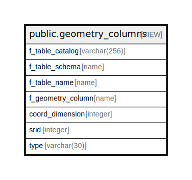

# public.geometry_columns

## Description

<details>
<summary><strong>Table Definition</strong></summary>

```sql
CREATE VIEW geometry_columns AS (
 SELECT (current_database())::character varying(256) AS f_table_catalog,
    n.nspname AS f_table_schema,
    c.relname AS f_table_name,
    a.attname AS f_geometry_column,
    COALESCE(postgis_typmod_dims(a.atttypmod), sn.ndims, 2) AS coord_dimension,
    COALESCE(NULLIF(postgis_typmod_srid(a.atttypmod), 0), sr.srid, 0) AS srid,
    (replace(replace(COALESCE(NULLIF(upper(postgis_typmod_type(a.atttypmod)), 'GEOMETRY'::text), st.type, 'GEOMETRY'::text), 'ZM'::text, ''::text), 'Z'::text, ''::text))::character varying(30) AS type
   FROM ((((((pg_class c
     JOIN pg_attribute a ON (((a.attrelid = c.oid) AND (NOT a.attisdropped))))
     JOIN pg_namespace n ON ((c.relnamespace = n.oid)))
     JOIN pg_type t ON ((a.atttypid = t.oid)))
     LEFT JOIN ( SELECT s.connamespace,
            s.conrelid,
            s.conkey,
            (regexp_match(s.consrc, 'geometrytype\(\w+\)\s*=\s*''(\w+)'''::text, 'i'::text))[1] AS type
           FROM ( SELECT pg_constraint.connamespace,
                    pg_constraint.conrelid,
                    pg_constraint.conkey,
                    pg_get_constraintdef(pg_constraint.oid) AS consrc
                   FROM pg_constraint) s
          WHERE (s.consrc ~* 'geometrytype\(\w+\)\s*=\s*''\w+'''::text)) st ON (((st.connamespace = n.oid) AND (st.conrelid = c.oid) AND (a.attnum = ANY (st.conkey)))))
     LEFT JOIN ( SELECT s.connamespace,
            s.conrelid,
            s.conkey,
            ((regexp_match(s.consrc, 'ndims\(\w+\)\s*=\s*(\d+)'::text, 'i'::text))[1])::integer AS ndims
           FROM ( SELECT pg_constraint.connamespace,
                    pg_constraint.conrelid,
                    pg_constraint.conkey,
                    pg_get_constraintdef(pg_constraint.oid) AS consrc
                   FROM pg_constraint) s
          WHERE (s.consrc ~* 'ndims\(\w+\)\s*=\s*\d+'::text)) sn ON (((sn.connamespace = n.oid) AND (sn.conrelid = c.oid) AND (a.attnum = ANY (sn.conkey)))))
     LEFT JOIN ( SELECT s.connamespace,
            s.conrelid,
            s.conkey,
            ((regexp_match(s.consrc, 'srid\(\w+\)\s*=\s*(\d+)'::text, 'i'::text))[1])::integer AS srid
           FROM ( SELECT pg_constraint.connamespace,
                    pg_constraint.conrelid,
                    pg_constraint.conkey,
                    pg_get_constraintdef(pg_constraint.oid) AS consrc
                   FROM pg_constraint) s
          WHERE (s.consrc ~* 'srid\(\w+\)\s*=\s*\d+'::text)) sr ON (((sr.connamespace = n.oid) AND (sr.conrelid = c.oid) AND (a.attnum = ANY (sr.conkey)))))
  WHERE ((c.relkind = ANY (ARRAY['r'::"char", 'v'::"char", 'm'::"char", 'f'::"char", 'p'::"char"])) AND (NOT (c.relname = 'raster_columns'::name)) AND (t.typname = 'geometry'::name) AND (NOT pg_is_other_temp_schema(c.relnamespace)) AND has_table_privilege(c.oid, 'SELECT'::text))
)
```

</details>

## Columns

| Name | Type | Default | Nullable | Children | Parents | Comment |
| ---- | ---- | ------- | -------- | -------- | ------- | ------- |
| f_table_catalog | varchar(256) |  | true |  |  |  |
| f_table_schema | name |  | true |  |  |  |
| f_table_name | name |  | true |  |  |  |
| f_geometry_column | name |  | true |  |  |  |
| coord_dimension | integer |  | true |  |  |  |
| srid | integer |  | true |  |  |  |
| type | varchar(30) |  | true |  |  |  |

## Referenced Tables

| Name | Columns | Comment | Type |
| ---- | ------- | ------- | ---- |
| [pg_class](pg_class.md) | 0 |  |  |
| [pg_attribute](pg_attribute.md) | 0 |  |  |
| [pg_namespace](pg_namespace.md) | 0 |  |  |
| [pg_type](pg_type.md) | 0 |  |  |
| [pg_constraint](pg_constraint.md) | 0 |  |  |

## Relations



---

> Generated by [tbls](https://github.com/k1LoW/tbls)
