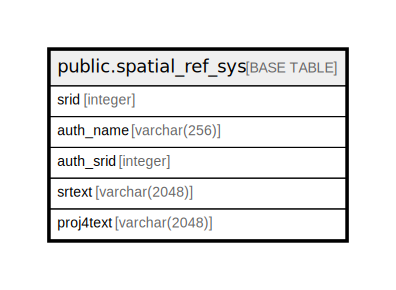

# public.spatial_ref_sys

## Description

## Columns

| Name | Type | Default | Nullable | Children | Parents | Comment |
| ---- | ---- | ------- | -------- | -------- | ------- | ------- |
| srid | integer |  | false |  |  |  |
| auth_name | varchar(256) |  | true |  |  |  |
| auth_srid | integer |  | true |  |  |  |
| srtext | varchar(2048) |  | true |  |  |  |
| proj4text | varchar(2048) |  | true |  |  |  |

## Constraints

| Name | Type | Definition |
| ---- | ---- | ---------- |
| spatial_ref_sys_srid_check | CHECK | CHECK (((srid > 0) AND (srid <= 998999))) |
| spatial_ref_sys_pkey | PRIMARY KEY | PRIMARY KEY (srid) |

## Indexes

| Name | Definition |
| ---- | ---------- |
| spatial_ref_sys_pkey | CREATE UNIQUE INDEX spatial_ref_sys_pkey ON public.spatial_ref_sys USING btree (srid) |

## Relations

---

> Generated by [tbls](https://github.com/k1LoW/tbls)
